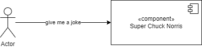
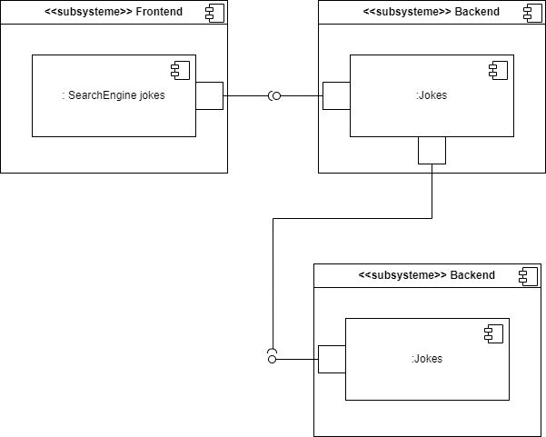

# Architecture

## Functional architecture
Just a simple diagram to show the different parts of the application.
A client will ask a joke to the application and she returns one.

## Software architecture
The software architecture consists of a frontend in Angular, a backend in Quarkus, and a PostgreSQL database. The backend provides REST APIs that are documented in the backend documentation. These APIs can be accessed directly by a client like CURL, and the frontend also accesses them. In a future version, the write APIs will be secured using OpenID.

## Technical architecture
For the architecture foundation, I use Kubernetes, specifically Micro K8s, hosted on a VM. The documentation is available [here](k8s.md).