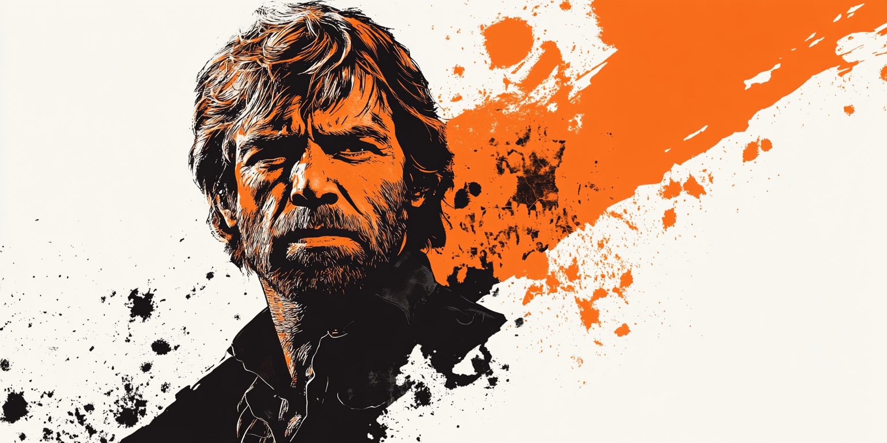
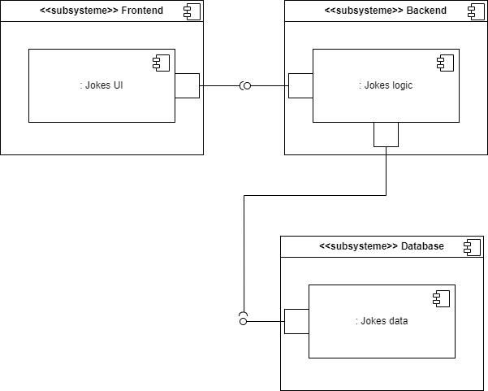

# Super Chuck Norris documentation

## Introduction

The Super Chuck Norris application is a web application that allows users to view Chuck Norris jokes.
The goal of this project is to demonstrate how to create a modern web application using recent technologies.
Finally, this application will be deployed on AWS using Terraform.
The application is composed of 3 parts:

## Index

* [Backend documentation](backend.md)
* [Frontend documentation](frontend.md)
* [Infrastructure as Code (IaC) documentation](iac.md)

## Architecture

### Functional architecture
Just a simple diagram to show the different parts of the application.
A client will ask a joke to the application and she returns one.

### Technical architecture
#### Docker Architecture (NOT IMPLEMENTED YET)

#### AWS Architecture (NOT IMPLEMENTED YET)

### Software architecture
