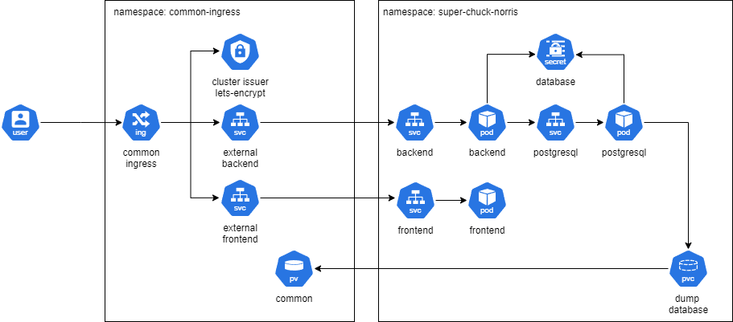

# Kubernetes documentation
## Technical stack

* Container orchestration: Micro K8S
* Gest OS for K8S: Ubuntu ARM64

## Requirements

* All container and your software inside need to be compiled on ARM64 architecture
* A ARM64 VM
* A DNS and a Let's Encrypt configuration

## Installation

I wanted to find hosting based on ARM64 for both financial and ecological reasons. After some research, I decided to go with [Hetzner](https://www.hetzner.com/) for my VM order, as it was the cheapest option I found with hosting in Europe.
I absolutely wanted a container orchestration based on K8S. I could have opted for a managed K8S service in a public cloud like AWS, but the exorbitant price quickly discouraged me. Therefore, I decided to use Micro K8S, which is compatible with ARM64. For the installation, I simply followed the official documentation.

List of addon to enable:

* cert-manager         # (core) Cloud native certificate management
* community            # (core) The community addons repository
* dashboard            # (core) The Kubernetes dashboard
* dns                  # (core) CoreDNS
* ha-cluster           # (core) Configure high availability on the current node
* helm                 # (core) Helm - the package manager for Kubernetes
* helm3                # (core) Helm 3 - the package manager for Kubernetes
* hostpath-storage     # (core) Storage class; allocates storage from host directory
* ingress              # (core) Ingress controller for external access
* metrics-server       # (core) K8s Metrics Server for API access to service metrics
* observability        # (core) A lightweight observability stack for logs, traces and metrics
* registry             # (core) Private image registry exposed on localhost:32000
* storage              # (core) Alias to hostpath-storage add-on, deprecated

## Architecture Diagram
There is two namespaces on this schema: "common" and "super-chuck-norris".

Soon, other applications will be added, and I want to have a single entry point while isolating the applications from each other. 
Common namespace is just responsible for Persistent Volume
Thus, each application will have its own namespace with all the components.