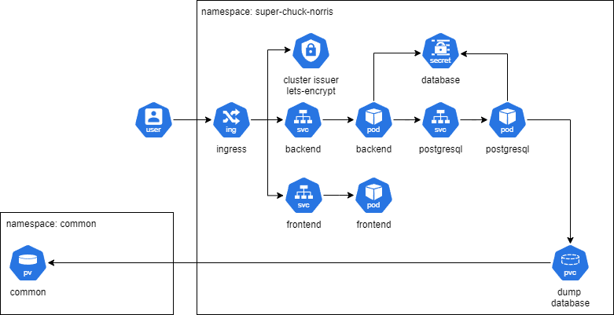

# Kubernetes documentation

## Technical stack

* Container orchestration: Kubernetes (kubeadm)
* OS: Ubuntu ARM64
* GitOps: FluxCD v2 (flux-operator)
* Package manager: Timoni (module OCI)
* Secrets: Sealed Secrets (Bitnami)
* Database: CloudNativePG

## Requirements

* ARM64 nodes (all container images are built for `linux/arm64`)
* A DNS entry for `chuck.filhype.ovh`
* cert-manager + ClusterIssuer `lets-encrypt`
* nginx Ingress Controller
* Sealed Secrets controller in `kube-system`
* CloudNativePG cluster `postgres` in namespace `postgres`
* FluxCD v2 (flux-operator) deployed in namespace `operators`

## Cluster nodes

| Hostname        | Role          | IP            |
|-----------------|---------------|---------------|
| hp              | control-plane | 192.168.1.23  |
| leeson-desktop  | worker        | 192.168.1.26  |
| leeson-jetson2  | worker        | 192.168.1.25  |

---

## GitOps flow (FluxCD + Timoni)

### Architecture

```
GitHub                         Flux (operators ns)          Cluster
──────────────────────         ───────────────────          ──────────────────────
iac-chucknorris-backend   →    GitRepository            →   chuck-norris ns
  deploy/                →      Kustomization            →    Namespace
    configmap.yaml                                             ConfigMap
    deployment.yaml                                           Deployment
    service.yaml                                              Service
    ingress.yaml                                              Ingress
    auth0-sealed-secret                                       Secret (auth0)
    db-sealed-secret                                          Secret (db)
```

### Continuous Deployment pipeline

```
1. Dev push → super-chuck-norris-backend (main)
       ↓
2. GitHub Actions: build native ARM64 image
   → push docker.io/leeson77/chuck-norris-backend:<sha>-snapshot-arm64
       ↓
3. GitHub Actions job `update-iac`:
   → checkout filhype-organization/iac-chucknorris-backend
   → sed deploy/deployment.yaml: update image tag
   → git commit "chore: deploy backend image <sha>-snapshot-arm64 [skip ci]"
   → git push
       ↓
4. Flux GitRepository: détecte le nouveau commit (interval: 1m)
       ↓
5. Flux Kustomization: applique deploy/ sur le cluster (interval: 5m)
       ↓
6. K8s rolling-update: nouveau pod arm64 en ~20ms (native Quarkus)
```

### Modification des templates Timoni

Quand les fichiers CUE changent (`templates/`, `timoni.cue`, `values.cue`) :

```
1. Dev push → iac-chucknorris-backend (main)
       ↓
2. GitHub Actions job `publish-module`:
   → push OCI module docker.io/leeson77/chuck-norris-backend-timoni:<tag>
       ↓
3. GitHub Actions job `render-manifests`:
   → timoni build → réécrit deploy/{configmap,deployment,service,ingress}.yaml
   → préserve le tag d'image courant dans deployment.yaml
   → git commit "chore: re-render manifests from timoni module [skip ci]"
       ↓
4-6. Même flux Flux que ci-dessus
```

---

## Premier déploiement (bootstrap)

### Prérequis secrets GitHub

Ajouter le secret `IAC_REPO_TOKEN` dans le repo `super-chuck-norris-backend` :

```
GitHub → super-chuck-norris-backend → Settings → Secrets → New repository secret
  Name:  IAC_REPO_TOKEN
  Value: <GitHub PAT avec accès contents:write sur iac-chucknorris-backend>
```

### Appliquer les ressources Flux

Les ressources FluxCD sont dans `flux/` du repo `iac-chucknorris-backend`.
Elles sont **déjà appliquées** sur le cluster. Pour les ré-appliquer manuellement :

```bash
kubectl apply -f infra/k8s/backend/flux/gitrepository.yaml
kubectl apply -f infra/k8s/backend/flux/kustomization.yaml
```

### Vérifier le statut

```bash
# État de la source Git
kubectl get gitrepository iac-chucknorris-backend -n flux-system

# État de la réconciliation
kubectl get kustomization chuck-norris-backend -n flux-system

# Ressources déployées
kubectl get all -n chuck-norris
```

### Forcer une réconciliation immédiate

```bash
kubectl annotate gitrepository iac-chucknorris-backend -n flux-system \
  reconcile.fluxcd.io/requestedAt="$(date -u +%Y-%m-%dT%H:%M:%SZ)" --overwrite
```

---

## Initialisation de la base de données

La table `Joke` doit être créée avant le premier démarrage du backend
(Hibernate est en mode `validate` — il vérifie le schéma sans le créer).

```bash
# Port-forward vers le pod PostgreSQL
kubectl port-forward -n postgres postgres-1 5432:5432

# Injecter le dump SQL
psql -h localhost -p 5432 -U app -d app < /path/to/dump.sql
```

Une fois le schéma injecté, le pod redémarre automatiquement et passe en `Running`.

---

## Structure du module Timoni

Le module se trouve dans le repo `iac-chucknorris-backend` :

```
infra/k8s/backend/
├── timoni.cue           # Configuration du module (instance + labels communs)
├── values.cue           # Schéma + valeurs par défaut
├── prod-values.cue      # Surcharges de production (pas de secrets)
├── templates/
│   ├── configmap.cue    # ConfigMap Quarkus (variables d'env non-sensibles)
│   ├── deployment.cue   # Deployment + probes + securityContext
│   ├── service.cue      # ClusterIP service
│   └── ingress.cue      # Ingress nginx + TLS cert-manager
├── deploy/              # Manifestes K8s pré-rendus → Flux applique ce dossier
│   ├── namespace.yaml
│   ├── configmap.yaml
│   ├── deployment.yaml  # Tag d'image mis à jour automatiquement par le CI
│   ├── service.yaml
│   ├── ingress.yaml
│   ├── auth0-sealed-secret.yaml
│   ├── db-sealed-secret.yaml
│   └── kustomization.yaml
└── flux/                # Ressources FluxCD (appliquées une fois manuellement)
    ├── gitrepository.yaml
    └── kustomization.yaml
```

### Images Docker

| Image | Registry | Architecture |
|-------|----------|--------------|
| `leeson77/chuck-norris-backend` | Docker Hub | ARM64 |
| `leeson77/chuck-norris-backend-timoni` | Docker Hub | N/A (OCI module) |

Format du tag backend : `<short-sha>-snapshot-arm64` (ex: `3f04235-snapshot-arm64`)

---

## Configuration Auth0

La configuration OIDC non-sensible est dans le ConfigMap `chuck-norris-backend-config`.
Le secret (`QUARKUS_OIDC_CREDENTIALS_SECRET`) est chiffré dans `auth0-sealed-secret.yaml`
et déchiffré automatiquement par le contrôleur Sealed Secrets.

| Propriété | Valeur |
|-----------|--------|
| Client ID | `2GSRAJdfhRYURWjwlnYwJlJN4J9cEi4o` |
| Issuer | `https://dev-lesson.eu.auth0.com/` |
| Auth Server URL | `https://dev-lesson.eu.auth0.com` |
| Audience | `chuck-norris-api` |
| Application type | `service` |
| Role claim path | `scope` |

---

## Architecture Diagram


